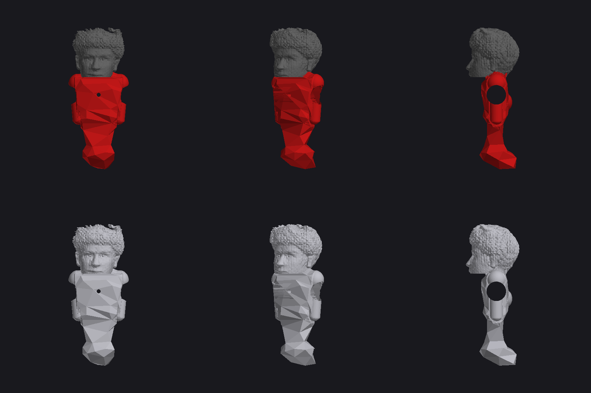

# Jugador de metegol 3D (con cara real)

Genera un jugador de metegol imprimible en 3D, con la **cabeza de una persona real**
montada sobre un cuerpo estándar, listo para montar en la varilla.



## Cómo se hizo

1. **Foto → 3D de la cabeza:** a partir de una foto de frente se generó un modelo 3D
   de la cabeza (con el demo gratuito **TripoSR** en Hugging Face, que permite
   descargar el `.obj`). El escaneo está en `fuente/cabeza_escaneada.obj`.
2. **Cuerpo paramétrico:** el script `build_player.py` construye el cuerpo del jugador
   (torso, hombros, brazos, piernas y pie) con primitivas, le resta el **agujero del eje**
   y el **agujero del pasador**, y le monta la cabeza encima.
3. **Cabeza nítida y estanca:** la cabeza se cierra con un corte con tapa
   (`slice_plane(cap=True)`) que la vuelve estanca **sin perder detalle de la cara**
   (a diferencia del re-mallado por vóxeles, que la emborrona). Se apoya sobre un
   **cuello corto**, con el mentón por encima de los hombros, estilo metegol clásico.
4. **Exportación:** cuerpo (estanco) + cabeza (estanca) se exportan juntos; el slicer
   los fusiona al imprimir.

## Archivos

| Archivo | Para qué |
|---|---|
| `salida/jugador_metegol_prueba.stl` | **Imprimir** (sólido, un color) |
| `salida/jugador_metegol_prueba.3mf` | Imprimir (alternativa) |
| `salida/jugador_metegol_prueba.glb` | Ver **a color** (visor 3D / celular) |
| `fuente/cabeza_escaneada.obj` | Cabeza escaneada (con color por vértice) |
| `build_player.py` | Generador paramétrico |

## Medidas de esta versión de PRUEBA

- Alto total: **~97 mm**
- Ancho de hombros: ~41 mm
- Cabeza (mentón→coronilla): ~26 mm, sobre cuello corto
- **Agujero del eje: 13,3 mm** (para varilla de 12,7 mm = ½") — atraviesa la cintura
- Agujero del pasador: 2,6 mm (perpendicular al eje)

> ⚠️ **El diámetro del eje es un valor estándar de prueba.** Hay que ajustarlo al
> metegol real antes de la versión definitiva.

## Cómo regenerar / ajustar medidas

Editar los parámetros arriba de `build_player.py` y correr:

```bash
pip install numpy trimesh manifold3d networkx lxml scikit-image pillow shapely rtree scipy
python build_player.py
```

Parámetros clave a cambiar cuando se tengan las medidas reales:

- `ROD_D` → diámetro real de la varilla (mm)
- `rod_z` → altura del agujero del eje
- `PIN_D` → diámetro del pasador (o cambiar a tornillo)
- `HEAD_MM` / `CHIN_Z` → tamaño y altura de la cabeza
- Medidas de los `box(...)` del cuerpo → para ajustar la altura/forma total

## Impresión

- Orientar **de pie**, con soportes (mentón y bajo el pie), PLA, ~15 % de relleno.
- Un solo color → pintar a mano. Color real → servicio full-color con el `.glb`.
